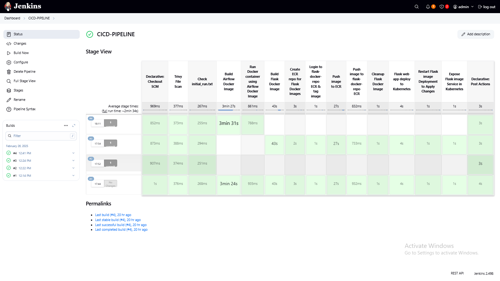
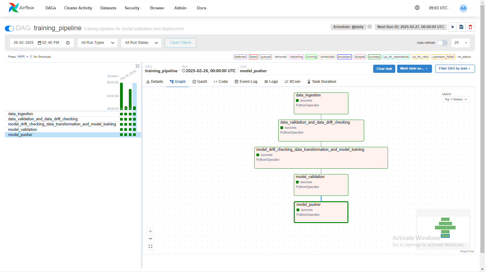
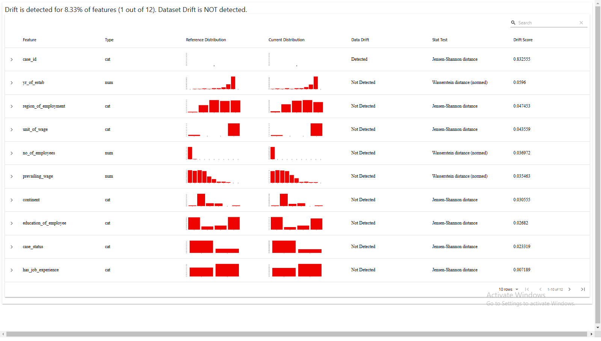
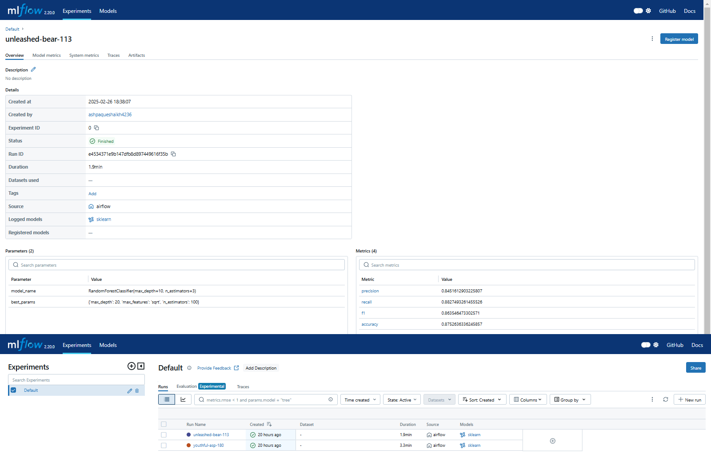
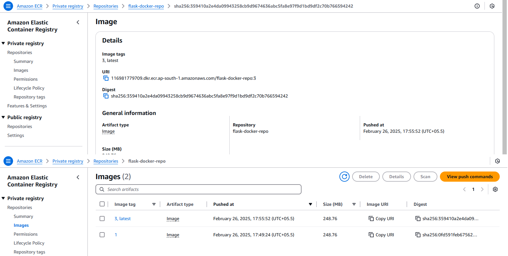
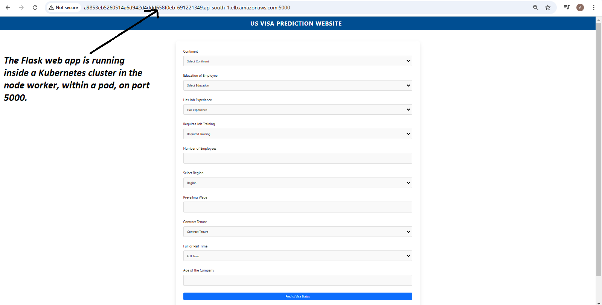
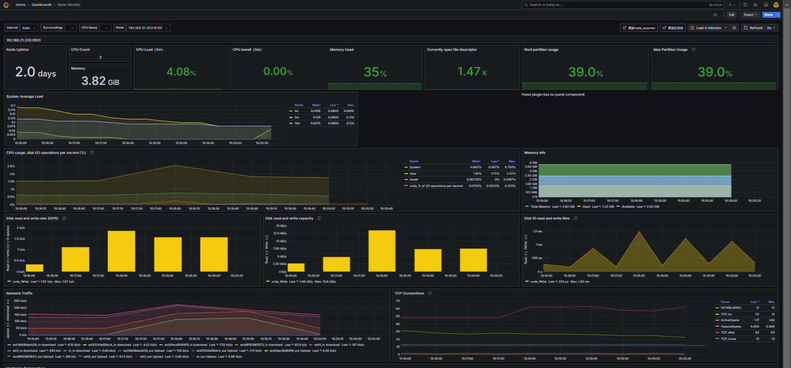
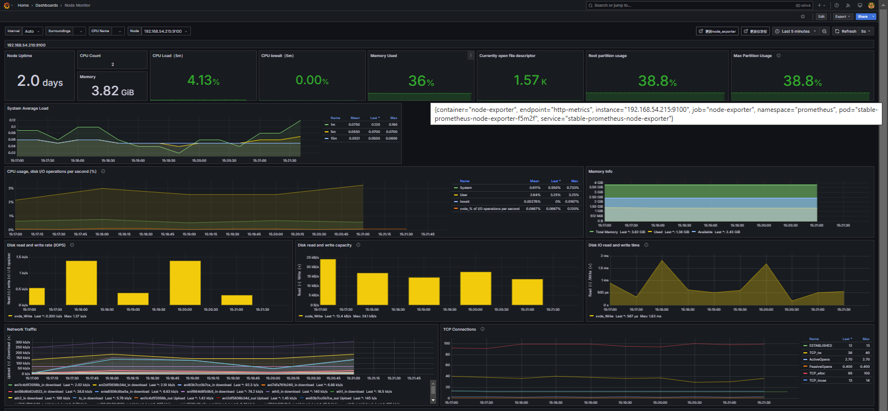

# US Visa Prediction Project
**Life cycle of Machine learning Project**

* Understanding the Problem Statement
* Data Collection
* Exploratory data analysis
* Data Cleaning
* Data Pre-Processing
* Model Training 
* Choose best model


### About
The Immigration and Nationality Act (INA) of the US permits foreign workers to come to the United States to work on either a temporary or permanent basis. 
The act also protects US workers against adverse impacts on working place and maintain requirements when they hire foreign workers to fill workforce shortages. The immigration programs are administered by the Office of Foreign Labor Certification (OFLC).

## Problem statement.

* OFLC gives job certification applications for employers seeking to bring foreign workers into the United States and grants certifications. 
* As In last year the count of employees were huge so OFLC needs Machine learning models to shortlist visa applicants based on their previous data.

**In this project we are going to use the data given to build a Classification model:**

* This model is to check if Visa get approved or not based on the given dataset.
* This can be used to Recommend a suitable profile for the applicants for whom the visa should be certified or denied based on the certain criteria which influences the decision.


# Project Setup Guide
## 1. Clone repository

Open a terminal (or Git Bash if you're on Windows)
Run the following command to clone the repository
```bash
git clone https://github.com/ashpaqueshaikh4236/MLOPS-Jenkins-Kubernetes-Deployment.git
```
```bash
cd MLOPS-Jenkins-Kubernetes-Deployment
```

## 2. Create and Activate the Virtual Environment

Create environment with Python 3.8
```bash
conda create -n visa python=3.8 -y
```

Activate the environment
```bash
conda activate visa
```


## 3. Install Dependencies

Install required packages
```bash
pip install -r requirements.txt
```

## 4. .gitignore File

Go to the `.gitignore` file and at the end, you will find the `artifact/*` entry. Simply comment it out by adding `#` before it, right before running `dvc init`.  

```bash
artifact/*
#artifact/*
```

## 5. Initialize DVC

Initialize DVC for version control
```bash
dvc init
```

## 6. Set Environment Variables

Set MongoDB URL
```bash
export MONGODB_URL="your_mongodb_url_here"
```
Set AWS credentials
```bash
export AWS_ACCESS_KEY_ID="your_aws_access_key_id_here"
export AWS_SECRET_ACCESS_KEY="your_aws_secret_access_key_here"
```

Set MLflow tracking details
```bash
export MLFLOW_TRACKING_URI="your_mlflow_tracking_uri_here"
export MLFLOW_TRACKING_USERNAME="your_mlflow_tracking_username_here"
export MLFLOW_TRACKING_PASSWORD="your_mlflow_tracking_password_here"
```

## 7. Run the Project

Run the Model Trainer script
```bash
python main.py
```

Run the Flask Web App 
```bash
python app.py
```

# Model Trainer Production Images
## 1.Jenkins-Pipeline-Git-SCM-Triggered-to-Email-Notification



## 2.Airflow-Pipeline-Data_ingestion-to-Model-Pusher



## 3.Evidently-ai-data-drift



## 4.Experiment-tracking-with-mlflow



## 5.Amazon-S3-Bucket-for-ML-Models


<br>
<br>
<br>

# Jenkins Kubernetes Deployment Production Images
## 1.Jenkins-Pipeline-Git-SCM-Triggered-to-Email-Notification


## 2.ECR-Repo-for-Docker-Images



## 3.Flask-Web-App-Running



## 4.Kubernetes-Cluster-Monitoring


## 5.Cluster-Nodeworker1-Monitoring


## 6.Cluster-Nodeworker2-Monitoring

