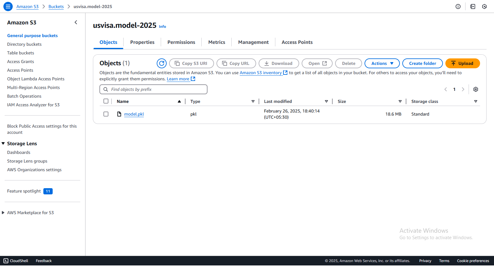
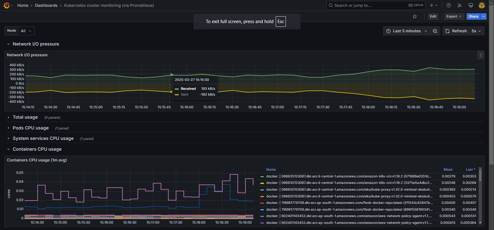

# Project Setup Guide
<br>
<br>
<br>

## 1. Clone repository

Open a terminal (or Git Bash if you're on Windows)
Run the following command to clone the repository
```bash
git clone https://github.com/ashpaqueshaikh4236/MLOPS-Jenkins-Kubernetes-Deployment.git
```
```bash
cd MLOPS-Jenkins-Kubernetes-Deployment
```

## 2. Create and Activate the Virtual Environment

Create environment with Python 3.8
```bash
conda create -n visa python=3.8 -y
```

Activate the environment
```bash
conda activate visa
```


## 3. Install Dependencies

Install required packages
```bash
pip install -r requirements.txt
```

## 4. .gitignore File

Go to the `.gitignore` file and at the end, you will find the `artifact/*` entry. Simply comment it out by adding `#` before it, right before running `dvc init`.  

```bash
artifact/*
#artifact/*
```

## 5. Initialize DVC

Initialize DVC for version control
```bash
dvc init
```

## 6. Set Environment Variables

Set MongoDB URL
```bash
export MONGODB_URL="your_mongodb_url_here"
```
Set AWS credentials
```bash
export AWS_ACCESS_KEY_ID="your_aws_access_key_id_here"
export AWS_SECRET_ACCESS_KEY="your_aws_secret_access_key_here"
```

Set MLflow tracking details
```bash
export MLFLOW_TRACKING_URI="your_mlflow_tracking_uri_here"
export MLFLOW_TRACKING_USERNAME="your_mlflow_tracking_username_here"
export MLFLOW_TRACKING_PASSWORD="your_mlflow_tracking_password_here"
```

## 7. Run the Project

Run the Model Trainer script
```bash
python main.py
```

Run the Flask Web App 
```bash
python app.py
```
<br>
<br>
<br>
<br>
<br>

# Model Trainer Production Images
## 1.Jenkins-Pipeline


## 2.Airflow-Pipeline-Data_ingestion-to-Model-Pusher


## 3.Evidently-ai-data-drift


## 4.Experiment-tracking-with-mlflow


## 5.Amazon-S3-Bucket-for-ML-Models



<br>
<br>
<br>

# Jenkins Kubernetes Deployment Production Images
## 1.Jenkins-Pipeline


## 2.ECR-Repo-for-Docker-Images


## 3.Flask-Web-App-Running


## 4.Kubernetes-Cluster-Monitoring



## 5.Cluster-Nodeworker1-Monitoring


## 6.Cluster-Nodeworker2-Monitoring
